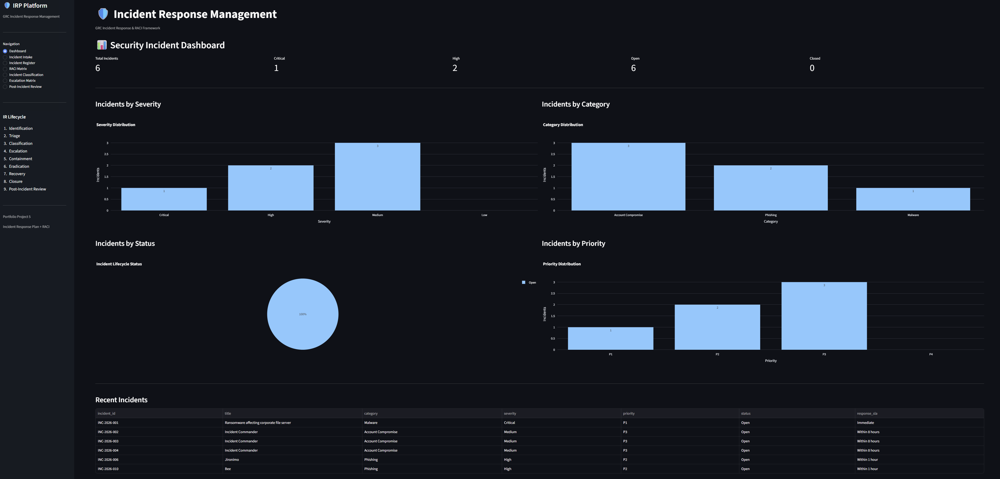

# 🛡️ Incident Response & GRC Management Platform


**Governance, Risk & Compliance (GRC)** application for managing information security incidents through a structured, risk-based incident response lifecycle.

Built with **Python, Streamlit and Pandas**, the platform combines incident management, severity assessment, escalation governance, RACI responsibilities, regulatory considerations, post-incident review, and GRC control mapping into a single application.

---

## 🎯 Project Objective

The objective of this project is to demonstrate how an organization can establish a structured and auditable Incident Response capability.

---

# 🧩 Key Capabilities

## Incident Management

* Create and track security incidents
* Unique incident identification
* Incident categorization
* Affected asset tracking
* Business impact assessment
* Affected user tracking
* Incident ownership
* Incident Commander assignment
* Incident lifecycle management

## Risk-Based Severity Assessment

The platform evaluates multiple impact dimensions:

* Business Impact
* Confidentiality
* Integrity
* Availability
* Data Exposure
* Regulatory Impact
* Financial Impact
* Affected Users
* Privileged Account Involvement
* Public Exposure

The assessment produces:

```text
Severity
   ↓
Priority
   ↓
Response SLA
   ↓
Escalation Requirements
```

---

# 🚨 Severity & Priority Model

| Severity | Priority | Response SLA   |
| -------- | -------- | -------------- |
| Critical | P1       | Immediate      |
| High     | P2       | Within 1 hour  |
| Medium   | P3       | Within 8 hours |
| Low      | P4       | Best effort    |

Critical incidents may trigger:

* Incident Commander activation
* CISO escalation
* Executive notification
* Legal / Privacy assessment
* Immediate containment
* Continuous response

---

# 👥 RACI Governance

The project implements a formal RACI model covering:

* Detection
* Triage
* Severity assessment
* Incident declaration
* Containment
* Eradication
* Recovery
* Regulatory assessment
* External communication
* Executive escalation
* Closure
* Post-Incident Review

Core roles include:

* Security Analyst
* Incident Commander
* IT Operations
* CISO
* Legal / Privacy
* HR
* Executive Management

The objective is to eliminate ambiguity around **who is Responsible and who is Accountable** during an incident.

---

# 📈 Incident Lifecycle

The application follows a controlled lifecycle:

```text
Open
  ↓
Investigating
  ↓
Contained
  ↓
Eradicated
  ↓
Recovered
  ↓
Closed
```

Lifecycle transitions are validated by application logic rather than allowing arbitrary status changes.

---

# 🔺 Escalation Management

The platform supports risk-based escalation.

Examples of immediate escalation triggers:

* Ransomware
* Sensitive data exposure
* Privileged account compromise
* Critical service disruption
* Significant financial impact
* Potential regulatory notification
* Executive account compromise
* Material third-party incidents

---

# 🔐 GRC & Compliance Alignment

The project is designed around common information security governance practices and demonstrates alignment concepts relevant to:

### ISO/IEC 27001

Examples include:

* Incident management
* Information security event handling
* Responsibilities and accountability
* Evidence and documentation
* Corrective actions
* Monitoring and review
* Control improvement

### GDPR

Where personal data may be involved, the workflow supports:

* Privacy impact assessment
* Regulatory consideration
* Stakeholder escalation
* Documentation of data exposure
* Notification assessment

> This project is a portfolio implementation and does not constitute legal advice or certification evidence.

---

# 🎛️ GRC Control Register

The project includes a control register connecting incident response activities with governance controls.

Example controls:

| Control                         | Purpose                              |
| ------------------------------- | ------------------------------------ |
| Incident Response Plan          | Maintain documented IR capability    |
| Incident Classification         | Apply consistent severity assessment |
| Incident Escalation             | Escalate based on risk               |
| Incident Communication          | Coordinate stakeholders              |
| Evidence Preservation           | Maintain investigation evidence      |
| Post-Incident Review            | Capture lessons learned              |
| Access Review                   | Address access-related weaknesses    |
| Regulatory Assessment           | Evaluate privacy obligations         |
| Third-Party Incident Management | Manage supplier incidents            |
| Incident Metrics                | Monitor response performance         |

---

# 🧪 Testing

The project includes automated tests covering core incident-management logic.

Test coverage includes:

* Severity mapping
* Priority mapping
* Response SLA
* Incident ID generation
* Input validation
* Lifecycle transitions
* Closure logic
* Incident summaries

Run the tests with:

```bash
python -m pytest
```

Expected result:

```text
12 passed
```

---

# ⚙️ Technology Stack

| Technology | Purpose                  |
| ---------- | ------------------------ |
| Python     | Application logic        |
| Streamlit  | Web application          |
| Pandas     | Data management          |
| Plotly     | Data visualization       |
| Pytest     | Automated testing        |
| CSV        | Lightweight data storage |
| Markdown   | GRC documentation        |

---

# 💻 Local Installation

## 1. Clone the repository

```bash
git clone https://github.com/DanielMogilevskiy/IRP-RACI-Incident-Response.git
```

```bash
cd Incident-Response
```

## 2. Create a virtual environment

Windows:

```bash
python -m venv .venv
```

Activate:

```bash
.venv\Scripts\activate
```

## 3. Install dependencies

```bash
pip install -r requirements.txt
```

## 4. Run tests

```bash
python -m pytest
```

## 5. Start the application

```bash
streamlit run app/app.py
```
---

# 🔎 Example Incident Scenarios

The platform can be used to model common security incident scenarios and demonstrate the corresponding GRC response workflow.

### 🔴 Ransomware

**Example workflow:**

```text
Incident Detection
→ Critical Severity
→ P1 Priority
→ Immediate Response
→ Incident Commander
→ CISO Escalation
→ Executive Notification
→ Legal / Privacy Assessment
→ Containment
→ Eradication
→ Recovery
→ Post-Incident Review
```

**GRC focus:** incident governance, escalation, business impact, regulatory assessment and corrective actions.

---

### 🔐 Privileged Account Compromise

**Example workflow:**

```text
Detection
→ High / Critical Severity
→ P1 / P2 Priority
→ Incident Commander
→ IT Operations
→ CISO Escalation
→ Account Containment
→ Evidence Preservation
→ Access Review
→ Recovery
→ Lessons Learned
```

**GRC focus:** privileged access, accountability, evidence preservation and control improvement.

---

### 🎣 Phishing Incident

**Example workflow:**

```text
Detection
→ Risk Assessment
→ Severity Classification
→ Investigation
→ Credential Reset
→ Monitoring
→ User Impact Assessment
→ Closure
→ Lessons Learned
```

**GRC focus:** risk-based classification, access management, awareness and corrective actions.

---

### 🔒 Potential Data Exposure

**Example workflow:**

```text
Detection
→ Impact Assessment
→ Data Exposure Assessment
→ Privacy Assessment
→ Legal Review
→ Regulatory Consideration
→ Containment
→ Corrective Actions
→ Post-Incident Review
```

**GRC focus:** privacy governance, regulatory assessment, documentation and accountability.

---

> **Note:** These scenarios represent example workflows that can be modeled using the Incident Response governance framework. External notifications, SIEM/EDR integrations, automated email alerts and regulatory submissions are outside the scope of this portfolio implementation.


---

# 📚 Documentation

Detailed governance documentation is available in `/docs`.

| Document                  | Purpose                  |
| ------------------------- | ------------------------ |
| `IRP.md`                  | Incident Response Plan   |
| `RACI.md`                 | Roles and accountability |
| `SEVERITY_MATRIX.md`      | Severity methodology     |
| `ESCALATION_MATRIX.md`    | Escalation rules         |
| `INCIDENT_LIFECYCLE.md`   | Incident lifecycle       |
| `POST_INCIDENT_REVIEW.md` | PIR methodology          |

Templates are available in `/templates`.

---

## 🌐 Web Interface (Streamlit)

**Try it live:** 👉 [Launch GRC Risk Heatmap Generator](https://danielmogilevskiy-irp-raci-incident-response.streamlit.app/)

In addition to the command-line tool, this project includes an **interactive web interface** built with [Streamlit](https://streamlit.io).  
It provides a more user-friendly way to generate risk heatmaps with visual feedback and real-time customisation.

### Features

- 📂 **Upload CSV** — drag & drop or browse for your risk data
- 🎨 **Colour palette selection** — choose from multiple schemes (Reds, Blues, Greens, etc.)
- 🔥 **Real-time heatmap** — instantly see your data visualised
- 💾 **Download results** — save the heatmap as a high-resolution PNG
- 🖥️ **Clean, intuitive UI** — perfect for non-technical stakeholders

### How to Run Locally

Make sure you're in the project root and your virtual environment is activated:

```bash
streamlit run app.py
```
Your browser will open automatically at http://localhost:8501.

[](https://danielmogilevskiy-irp-raci-incident-response.streamlit.app/)



---

## 🤝 Contributing

Contributions, suggestions and improvements are welcome.

Please open an issue or submit a pull request for proposed changes.

---

## 📄 License

This project is licensed under the **MIT License**.

See the `LICENSE` file for the full license text.

---

## 👤 Author

Maintained as part of a practical Cybersecurity GRC portfolio.

Maintained by [Daniel Mogilevskiy](https://www.linkedin.com/in/daniel-mogilevskiy/)